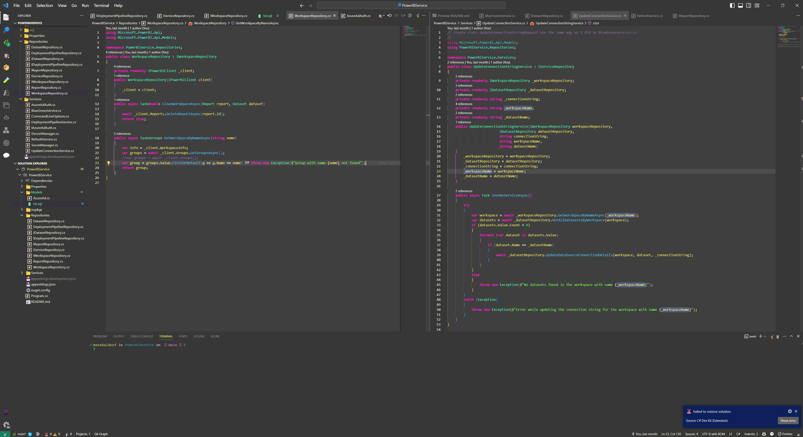

# AllDwarf's Themes

There are two themes in this project. Azure Data Studio and VS Code Theme based on [Cyberpunk](https://github.com/prometheux-ar/cyberpunk) theme and classic light theme called Ironforge.

## Preview
### Alldwarf's Cyberpunk

### AllDwarf's Ironforge

## Build new .VSIX package
Using  `vsce package` you can create .vsix file and use it later for installation.

## Installation

The current release is available to [download as a .vsix file](releases/cyberalldwarf-0.0.1.vsix) and can be installed by opening the command palette and selecting `Extensions: Install from VSIX...`

Once installed, set your color theme to `AllDwarf's Cyperpunk`

## License

This project is licensed under the MIT License - see the [LICENSE.md](LICENSE.md) file for details